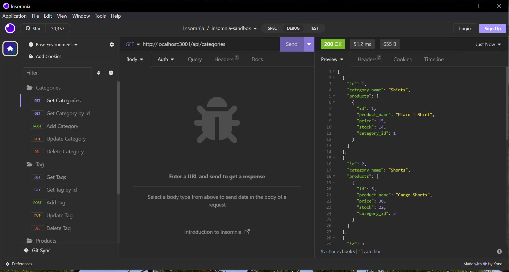
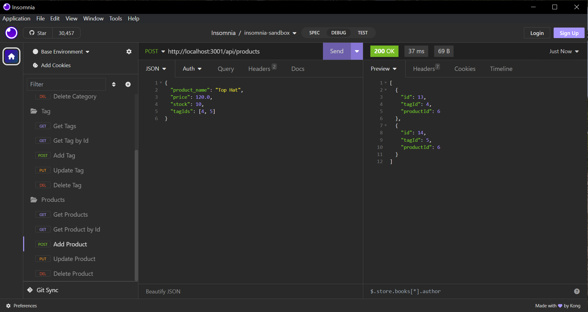

# E-Commerce Backend

## Description

This is an e-commerce backend program run with sequelize and express, through insomnia.

## Usage

This program doesn't have much to it, but it still does a lot. The database has 3 tables (and a 4th to accomodate a many-to-many relationship). For each of the 3 the user can view all table info, plus relevant associations, view a single table item by its is, create a new item, update an existing item, or delete an item. The tables are accessible through the localhost and the api extensions (/categories for the category table; /products for the product table; /tags for tag table). each of the view one, update and delete paths require the id of the item in question. Structure for adding or updating table data is as follows: All tables use a json object. For a category the category name must be provided. For a tag the tag name must be provided. The product is the most complex, requiring product name, price and number in stock, plus an optional category id or an array of tag ids.

## Link

As this is a backend program accessible through insomnia or a similar program, it is not deployed anywhere. Instead, watch a video demo here:
https://www.loom.com/share/64efd737673a40e4aa2838c3f23afaab?sid=630073dc-5631-4cc0-b343-865a49901eb4

## Credits

All the code is my own aside from that provided already in the assignment, and some that I learned in class. 